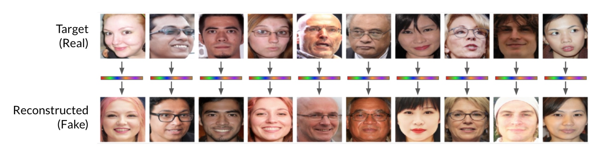

# Privacy Preserving RAG

Retrieval-Augmented Generation is an approach that enhances natural language generation by combining a neural network with a retrieval system, that retrieves relevant information from a vector database and adds it to the context to improve the generated text output.

There are three main data components stored in the vector database...

- **Data**: typically these are chunks of text or other pieces of raw data that are going to be retrieved and then added to the model context
- **Metadata**: some additional information that is useful for the retrieval system, for example document version or last date when document was updated 
- **embeddings**: vector representations of the raw data used for semantic search


## Data and Metadata Encryption

Data could be protected using [client side field-level encryption](https://www.mongodb.com/docs/manual/core/csfle/) mechanism offered by MongoDB Atlas (similar mechanism is available in the other database engies as well).

Metadata could be protected using a very unique technology offered by MongoDB Atlas - [Queryable Encryption](https://www.mongodb.com/docs/manual/core/queryable-encryption/) that allows user to query for equality and some other conditions.

## Embeddings Encryption

Vector databases represent data as a structured collection of multidimensional vectors called "embeddings" that are not human readable. 

**The raw data used to produce these "embeddings" can be partially recovered, making data leakage possible.** It possess a significant security risk and coulbe be eliminated if we can encrypt embeddings.



Here are some references:

- [Realistic Face Reconstruction from Deep Embeddings](https://github.com/evendrow/face-reconstruction)
- [Inverting face embeddings with convolutional neural networks](https://arxiv.org/abs/1606.04189)
- [Sentence Embedding Leaks More Information than You Expect: Generative Embedding Inversion Attack to Recover the Whole Sentence](https://arxiv.org/abs/2305.03010)


Encrypting embeddings while preserving the distances between them is a crucial requirement in scenarios where you want to perform similarity searches on sensitive data without exposing the actual data. 

This involves using encryption techniques that allow certain types of computations to be performed on the encrypted data, such as calculating distances or performing nearest neighbor searches. Available options are: homomorphic encryption, secure multiparty computation, lacality-sensitive hashing, functional encryption or... salty embeddings.


## Salty Embeddings

"Salty embeddings" are embeddings where the order of vector elements is shuffled according to a fixed, randomly selected key that we call "salt". 

The distance between salty embeddings remains the same as the distance between the original embeddings. However, because of the shuffling, salty embeddings cannot be reversed to obtain the original embeddings. 

Due to the length of the original embeddings the number of potential salts is quite large that makes attacks quite challenging.

```
# Query embedding
query_emb = np.random.rand(128) 

# Document embedding
embedding = np.random.rand(128) 

# Salt - fixed random permutation of embedding elements
salt = np.random.permutation(len(embedding)) 

salty_query = query_emb[salt]
salty_embedding = embedding[salt]

# Check whether distance is preserved
query_emb.dot(embedding), salty_query.dot(salty_embedding)
```

The other option would be to use random projection from high-dimensional embedding space to the space of the similar dimensionality to obtain salty embeddings.
